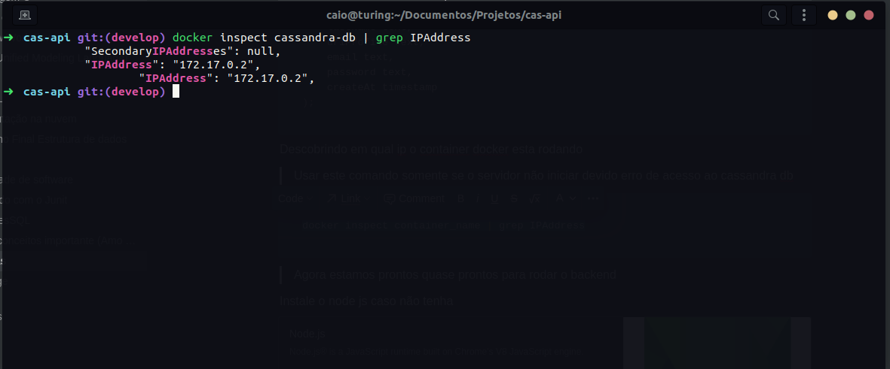

# cas_api

### Instalação do docker no windows

[iNSTALAÇÃO NO WINDOWS](https://docs.docker.com/desktop/windows/install/)

### Instalação do docker no Ubuntu
[INSTALAR NO UBUNTU](https://docs.docker.com/engine/install/ubuntu/)
 
## Procedimentos
Baixar imagem docker

```bash
docker pull cassandra
```

Ver quais imagem você tem na maquina

```bash
docker images
```

Criando e iniciando um container 

```bash
docker run -d --name cassandra-db -p 9842:9842 cassandra
```

Iniciar o bash no container criado

```bash
docker exec -it cassandra-db bash
```

Entra no cassandra db

```bash
cqlsh
```

Criar um kayspace

```bash
		CREATE KEYSPACE IF NOT EXISTS api_cas WITH REPLICATION = { 'class': 'SimpleStrategy', 'replication_factor' : '1'};
```

Criando primeira tabela

```bash
CREATE TABLE user (
    id UUID PRIMARY KEY, 
    name text,
    lastName text,
    uriProfile text,
    email text,
    password text,
    createAt timestamp 
);
```

Descobrindo em qual ip o container docker esta rodando

Um exemplo de execução do comando logo abaixo



O que nos importa ali é o IPAddress: "172.12.0.2", que no meu caso é este, no seu pc possivelmente sera outro.

```bash
docker inspect container_name | grep IPAddress
```

> Usar este comando somente se o servidor não iniciar devido a erro de acesso ao cassandra db


> Agora estamos quase prontos para rodar o backend

Instale o node js caso não tenha

[Node.js](https://nodejs.org/en/)

Instalando o node js, com ele vem junto o npm, que é o gerenciador de pacotes do node. Porem vamos utiliza o yarn por ele ser mais rápido e da menos bugs.

O yarn pode ser instalado através  desse link logo a baixo.

[Yarn](https://classic.yarnpkg.com/en/docs/install/#debian-stable)

Enfim podemos rodar o nosso projeto, basta acessar o raiz do projeto. E lembre-se de dar start no container cassandra-db, caso não tenha iniciado o container temos o comando abaixo para iniciar.

```bash
docker start cassandra-db
```

Agora ate que em fim podemos rodar o nosso servidor e testar com o insomnia

Primeiro abra o terminal na raiz do projeto e execute o comando logo abaixo, ele vai baixar todas as dependências necessárias para executar o projeto.

```bash
yarn install
```

Execute o comando abaixo e seja feliz

```bash
yarn dev
```

Para testar baixe o insomnia. Pode ser baixado no link logo abaixo.

[BAIXAR O INSOMNIA](https://insomnia.rest/download)